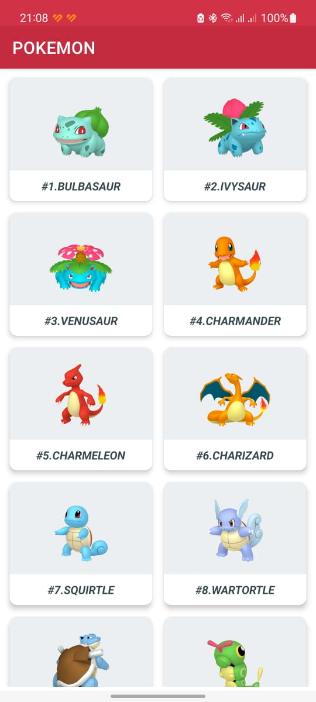
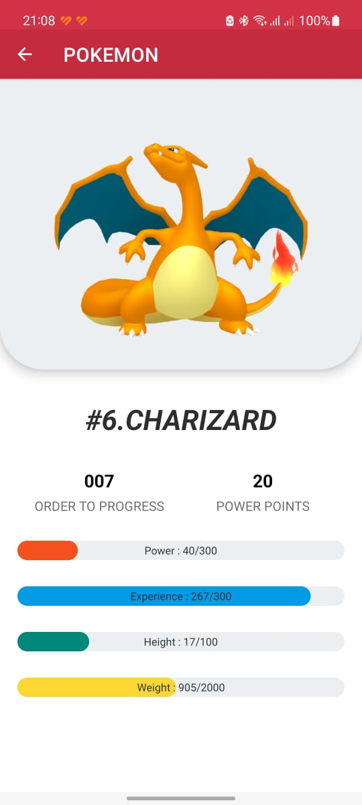
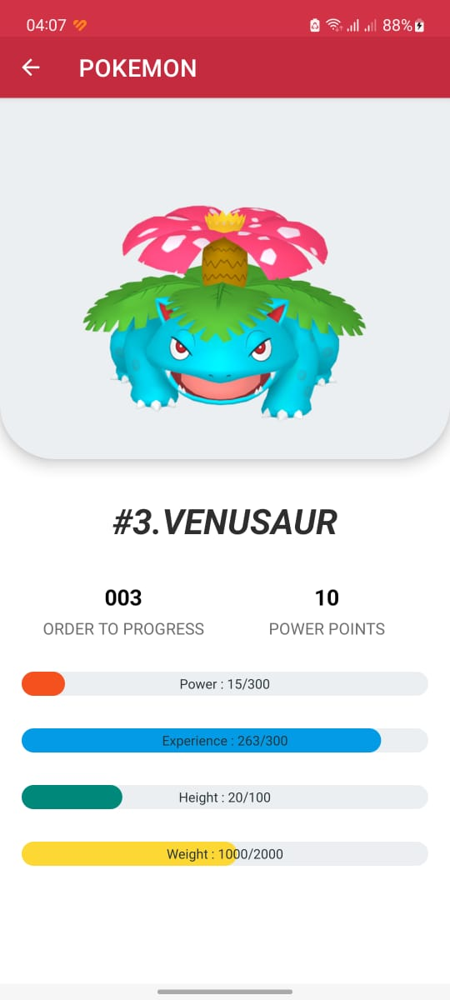

# App Pokémon (Android)
- Cette application android consommer une API (Pokeapi) comme exemple.
- L'application strecturé et filtrer les données reçu.

## Les plugins et L'api utilisé

- L'API utilisé **'Pokeapi'** (https://pokeapi.co/).
- **Retrofit** pour faciliter la consommation l'API (https://square.github.io/retrofit/).
- **Lombok project** pour générer les constructeurs, getters et setters dans les classes **'POJO'**.
- **RecyclerView** pour charger les articles 'items' et structurer l'affichage des données.

## Structure des packages dans le projet
```bash
com
   |-- emsi
   |   |-- pokapp
   |   |   |-- adapter
   |   |   |    |-- ListPokemonAdapter
   |   |   |-- connection
   |   |   |    |-- ApiConnection
   |   |   |-- models
   |   |   |    |-- Pokemon
   |   |   |    |-- PokemonInfo
   |   |   |    |-- PokemonMove
   |   |   |-- response
   |   |   |    |-- PokemonResponse
   |   |   |-- services
   |   |   |    |-- IPokemonServiceAPI
   |   |   |-- MainActivity
   |   |   |-- PokemonActivity
   |   |-- pokapp
   |-- emsi
com
```

## Explication de code et techniques utilisé

#### Class "ApiConnection"

```java
public class ApiConnection {
    private static Retrofit retrofit;
    private static IPokemonServiceAPI pokemonServiceAPI;

    private ApiConnection(){
        try {
            retrofit = new Retrofit.Builder().baseUrl("https://pokeapi.co/api/v2/")
                    .addConverterFactory(GsonConverterFactory.create()).build();
            pokemonServiceAPI = retrofit.create(IPokemonServiceAPI.class);
        }catch (Exception exception){ exception.printStackTrace(); }
    }

    public static synchronized IPokemonServiceAPI getInstance(){
        if(Objects.isNull(retrofit) || Objects.isNull(pokemonServiceAPI)) new ApiConnection();
        return pokemonServiceAPI;
    }
}
```

#### Classes ou models "Pokemon, PokemonInfo, PokemonMove"

```java
@NoArgsConstructor
@Getter(value = AccessLevel.PUBLIC)
@Setter(value = AccessLevel.PUBLIC)
public class Pokemon {
    private String name;

    private String url;
}

```

```java
@NoArgsConstructor
@Getter(value = AccessLevel.PUBLIC)
@Setter(value = AccessLevel.PUBLIC)
public class PokemonInfo {
    @SerializedName("base_experience")
    private int experience;

    private int height;

    private int weight;

    private int order;
}
```

```java
@NoArgsConstructor
@Getter(value = AccessLevel.PUBLIC)
@Setter(value = AccessLevel.PUBLIC)
public class PokemonMove {
    private int power;

    @SerializedName("pp")
    private int powerPoints;
}
```

#### Class "PokemonResponse"

```java
@NoArgsConstructor
@Getter(value = AccessLevel.PUBLIC)
@Setter(value = AccessLevel.PUBLIC)
public class PokemonResponse {
    @SerializedName("results")
    private List<Pokemon> pokemonCall = new ArrayList<>();
}
```

#### Interface "IPokemonServiceAPI"

```java
public interface IPokemonServiceAPI {
    @GET("pokemon")
    Call<PokemonResponse> pokemonResponseCall(@Query("offset") int offset, @Query("limit") int limit);

    @GET("pokemon/{id}")
    Call<PokemonInfo> pokemonInfoCall(@Path("id") int id);

    @GET("move/{id}")
    Call<PokemonMove> pokemonMoveCall(@Path("id") int id);
}
```

#### Class "ListPokemonAdapter"

```java
public class ListPokemonAdapter extends RecyclerView.Adapter<ListPokemonAdapter.ViewHolder> {
    private static String TAG = "POKEMON";
    private List<Pokemon> ListPokemon;
    private Context context;
    public ListPokemonAdapter(@NonNull Context context) {
        this.context = context;
        this.ListPokemon = new ArrayList<>();
    }

    @NonNull
    @Override
    public ViewHolder onCreateViewHolder(ViewGroup viewGroup, int i) {
        View view = LayoutInflater.from(viewGroup.getContext()).inflate(R.layout.pokemo_list_item, viewGroup, false);
        return new ViewHolder(view);
    }

    @Override
    public void onBindViewHolder(ViewHolder viewHolder, int i) {
        Pokemon pokemon = ListPokemon.get(i);

        String[] idFromUrl = pokemon.getUrl().split("/");
        int id = Integer.parseInt(idFromUrl[idFromUrl.length -1]);

        String imageUrl = "https://raw.githubusercontent.com/PokeAPI/sprites/master/sprites/pokemon/other/home/" + id + ".png";

        Picasso.get().load(imageUrl).into(viewHolder.imageView);
        viewHolder.textViewName.setText("#" + id + "." + pokemon.getName());

        viewHolder.itemView.setOnClickListener((view) -> {
            Intent intent = new Intent(context, PokemonActivity.class);
            intent.putExtra("id", String.valueOf(id));
            intent.putExtra("name", pokemon.getName());
            intent.putExtra("imageUrl", imageUrl);
            context.startActivity(intent);
        });
    }

    @Override
    public int getItemCount() {
        return ListPokemon.size();
    }

    public void copyListPokemon(List<Pokemon> ListPokemon){
        this.ListPokemon.addAll(ListPokemon);
        notifyDataSetChanged();
    }

    public static class ViewHolder extends RecyclerView.ViewHolder{
        private ImageView imageView;
        private TextView textViewName;

        public ViewHolder(View itemView) {
            super(itemView);
            imageView = (ImageView) itemView.findViewById(R.id.itemImage);
            textViewName = (TextView) itemView.findViewById(R.id.itemTitle);
        }
    }
}
```

#### Class "MainActivity"

```java
public class MainActivity extends AppCompatActivity {
    private static String TAG = "POKEMON";
    private static int offset = 0;
    private static boolean status = false;
    private ListPokemonAdapter listPokemonAdapter;
    private RecyclerView recyclerView;

    @Override
    protected void onCreate(Bundle savedInstanceState) {
        super.onCreate(savedInstanceState);
        setContentView(R.layout.activity_main);
        AppCompatDelegate.setDefaultNightMode(AppCompatDelegate.MODE_NIGHT_NO);

        StrictMode.ThreadPolicy threadPolicy = new StrictMode.ThreadPolicy.Builder().permitAll().build();
        StrictMode.setThreadPolicy(threadPolicy);

        this.listPokemonAdapter = new ListPokemonAdapter(this);

        this.recyclerView = (RecyclerView) findViewById(R.id.listPokemonView);
        this.recyclerView.addItemDecoration(new SpacingBetweenItems(20, 20, 20, 20));
        this.recyclerView.setAdapter(this.listPokemonAdapter);
        this.recyclerView.setHasFixedSize(true);

        this.onScrolled(this.recyclerView, 2);
        this.onCharge(offset);
    }

    private void onCharge(int offset){
        ApiConnection.getInstance().pokemonResponseCall(offset, 20).enqueue(new Callback<PokemonResponse>() {
            @Override
            public void onResponse(Call<PokemonResponse> call, Response<PokemonResponse> response) {
                status = true;
                if(!response.isSuccessful()) {
                    Log.d(TAG, "onResponse: " + response.message());
                    return;
                }
                listPokemonAdapter.copyListPokemon(response.body().getPokemonCall());
            }

            @Override
            public void onFailure(Call<PokemonResponse> call, Throwable t) {
                status = true;
                Log.i(TAG, "Error : " + t.getMessage());
            }
        });
    }

    private void onScrolled(RecyclerView recyclerView, int item){
        GridLayoutManager gridLayoutManager = new GridLayoutManager(this, item);
        recyclerView.setLayoutManager(gridLayoutManager);

        recyclerView.addOnScrollListener(new RecyclerView.OnScrollListener() {
            @Override
            public void onScrolled(@NonNull RecyclerView recyclerView, int dx, int dy) {
                super.onScrolled(recyclerView, dx, dy);
                if(dy > 0){
                     int visibleItems = gridLayoutManager.getItemCount();
                     int totalItems = gridLayoutManager.getItemCount();
                     int pastVisibleItems = gridLayoutManager.findFirstVisibleItemPosition();

                    if(status){
                        if(visibleItems + pastVisibleItems >= totalItems){
                            status = false;
                            offset += 20;
                            onCharge(offset);
                        }
                    }
                }
            }
        });
    }

}
```

#### Class "PokemonActivity"

```java
public class PokemonActivity extends AppCompatActivity {
    private static String TAG = "POKEMON";
    private Intent intent;
    private ProgressBar progressPower, progressExperience, progressHeight, progressWeight;
    private TextView textName, textOrder, textPowerPoints, textPower, textExperience, textHeight, textWeight;

    @Override
    protected void onCreate(@Nullable Bundle savedInstanceState) {
        super.onCreate(savedInstanceState);
        setContentView(R.layout.activity_pokemon);

        this.intent = getIntent();

        this.textName = findViewById(R.id.textName);
        this.textOrder = findViewById(R.id.textOrder);
        this.textPowerPoints = findViewById(R.id.textPowerPoints);
        this.textPower = findViewById(R.id.textPower);
        this.textExperience = findViewById(R.id.textExperience);
        this.textHeight = findViewById(R.id.textHeight);
        this.textWeight = findViewById(R.id.textWeight);

        this.progressPower = findViewById(R.id.progressPower);
        this.progressExperience = findViewById(R.id.progressExperience);
        this.progressHeight = findViewById(R.id.progressHeight);
        this.progressWeight = findViewById(R.id.progressWeight);

        int id = Integer.parseInt(intent.getStringExtra("id"));

        Picasso.get().load(intent.getStringExtra("imageUrl")).into((ImageView) findViewById(R.id.mainImage));
        this.textName.setText("#" + id + "." + intent.getStringExtra("name"));

        ApiConnection.getInstance().pokemonMoveCall(id).enqueue(new Callback<PokemonMove>() {
            @Override
            public void onResponse(Call<PokemonMove> call, Response<PokemonMove> response) {
                if(response.isSuccessful()) {
                    PokemonMove pokemonMove = response.body();

                    textPowerPoints.setText(String.format("%01d", pokemonMove.getPowerPoints()));

                    ObjectAnimator.ofInt(progressPower, "progress", 1, pokemonMove.getPower()).setDuration(500).start();
                    textPower.setText("Power : " + pokemonMove.getPower() + "/" + progressPower.getMax());
                }
            }

            @Override
            public void onFailure(Call<PokemonMove> call, Throwable t) { Log.i(TAG, "Error : " + t.getMessage()); }
        });

        ApiConnection.getInstance().pokemonInfoCall(id).enqueue(new Callback<PokemonInfo>() {
            @Override
            public void onResponse(Call<PokemonInfo> call, Response<PokemonInfo> response) {
                if(response.isSuccessful()) {
                    PokemonInfo pokemonInfo = response.body();

                    textOrder.setText(String.format("%03d", pokemonInfo.getOrder()));

                    ObjectAnimator.ofInt(progressExperience, "progress", 1, pokemonInfo.getExperience()).setDuration(500).start();
                    textExperience.setText("Experience : " + pokemonInfo.getExperience() + "/" + progressExperience.getMax());

                    ObjectAnimator.ofInt(progressHeight, "progress", 1, pokemonInfo.getHeight()).setDuration(500).start();
                    textHeight.setText("Height : " + pokemonInfo.getHeight() + "/" + progressHeight.getMax());

                    ObjectAnimator.ofInt(progressWeight, "progress", 1, pokemonInfo.getWeight()).setDuration(500).start();
                    textWeight.setText("Weight : " + pokemonInfo.getWeight() + "/" + progressWeight.getMax());
                }
            }

            @Override
            public void onFailure(Call<PokemonInfo> call, Throwable t) { Log.i(TAG, "Error : " + t.getMessage()); }
        });
    }
}
```

# Screenshots
<div align="center">
    
    &nbsp; &nbsp; &nbsp;
    
    &nbsp; &nbsp; &nbsp;
    
</div>


